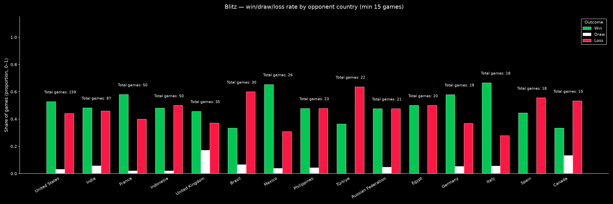
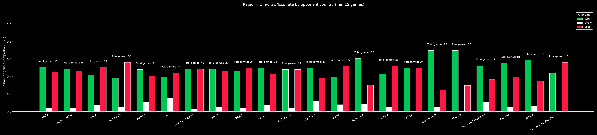
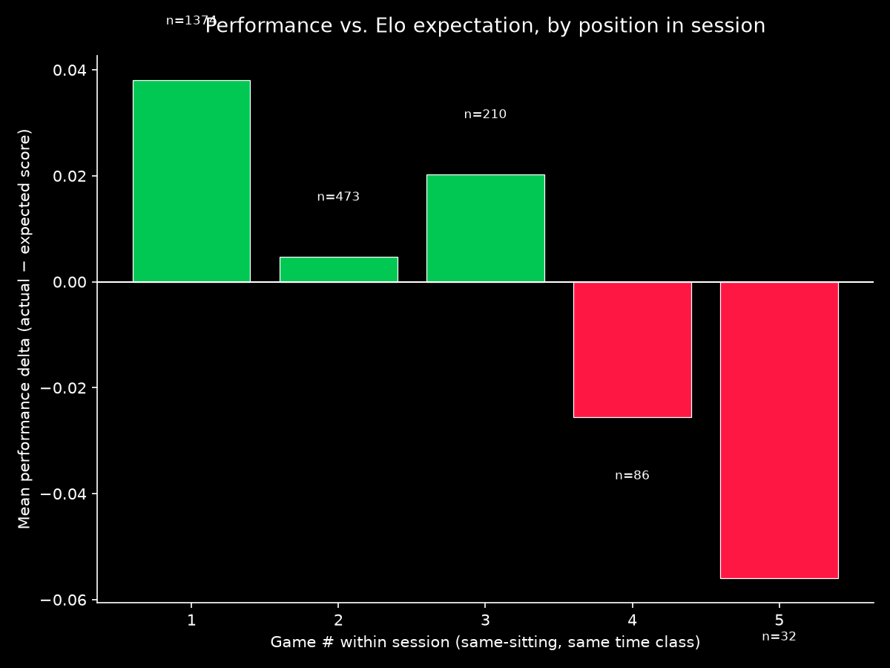
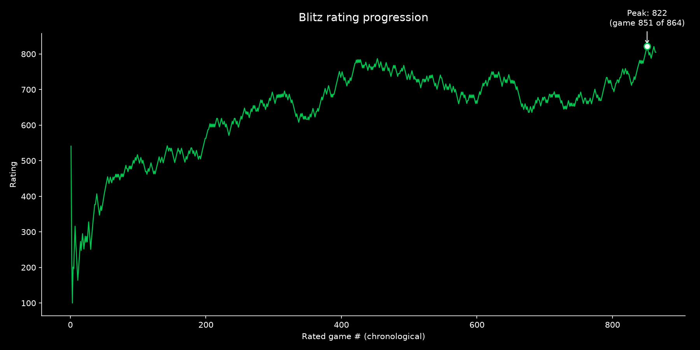
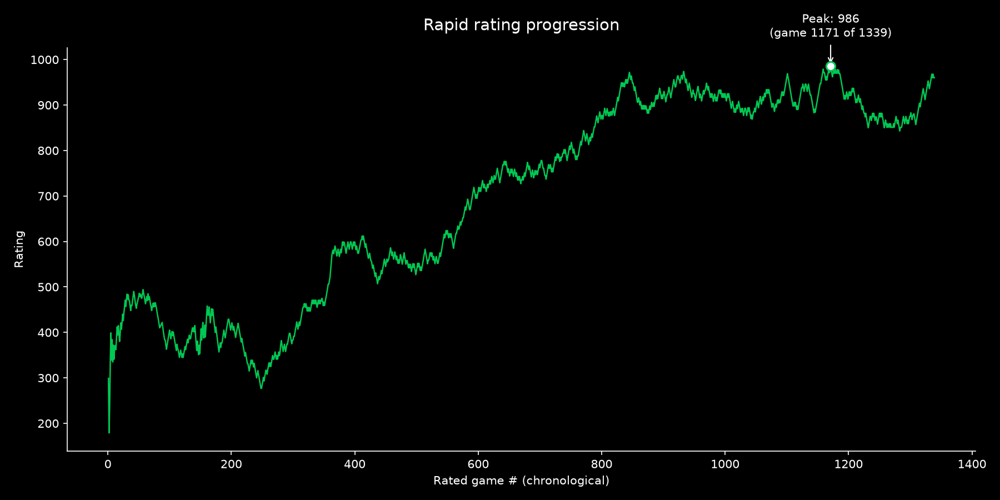

# chess-analytics

Pulls your full chess.com game history, resolves opponent countries, and
produces win/draw/loss tables and charts by country — refreshed daily via
GitHub Actions.

The API: https://api.chess.com/pub/player/{username}/games/archives gives you a list of monthly archive URLs, each returning full PGNs with clock times if you played with a clock.

<!-- STATS:START -->
### Last updated: 2026-08-22 06:58 UTC

**Dataset:** 2207 rated games, 2023-02-16 to 2026-08-21

**Statistically flagged countries this run** (Bonferroni-corrected within this run's test set —
does *not* correct across repeated daily runs; see notes in `chess_analytics/stats.py`):

_No country crosses the Bonferroni-corrected significance threshold this run — consistent with the earlier manual finding that country has no strong effect on your results once tested properly._

**Session fatigue** (does performance decline the longer you play in one sitting? —
sessions inferred from time gaps, see `chess_analytics/sessions.py`):

Based on 1374 inferred sessions, 2207 games. Position-vs-performance correlation: ρ=-0.0295, p=0.1696 — not distinguishable from no trend. First game of session vs. later games: later games score worse by 0.034 on average, p=0.0866 — not distinguishable from noise. _Both tests use α=0.05 uncorrected for this specific comparison — treat a single borderline p-value as a lead to watch over time, not a confirmed effect, same caveat as the country analysis._

**Peak rating** (see `chess_analytics/milestones.py` — this is a moving target, updates as new games are added):

- **Blitz**: peak rating **822**, reached after 851 of 864 rated games, on 2026-08-13 — you've since come back down from it
- **Rapid**: peak rating **986**, reached after 1171 of 1327 rated games, on 2026-04-16 — you've since come back down from it

**Charts:**

Full tables: [`data/country_outcome_tables.xlsx`](data/country_outcome_tables.xlsx) ·
Significance tests: [`data/significance_report.csv`](data/significance_report.csv) ·
Session fatigue data: [`data/session_fatigue_report.csv`](data/session_fatigue_report.csv) ·
Peak rating data: [`data/peak_rating_report.csv`](data/peak_rating_report.csv)
<!-- STATS:END -->

## Setup

1. In **Settings → Secrets and variables → Actions → Variables**, add:
   - `CHESS_USERNAME` = your chess.com username
   - `CHESS_CONTACT_EMAIL` = a real email (chess.com's API wants an
     identifying User-Agent; an anonymous/browser-spoofed one risks
     silent rate-limiting)
2. Confirm **Settings → Actions → General → Workflow permissions** is set to
   "Read and write permissions" — the workflow needs to commit files back.
3. Trigger it once manually (Actions tab → "Refresh chess.com stats" →
   "Run workflow") to do the initial full pull. This first run fetches your
   entire history and resolves every opponent, so expect it to take longer
   than subsequent runs — with 2,000+ opponents, budget several minutes.

## What runs on schedule

Daily at 06:17 UTC (see `.github/workflows/refresh_stats.yml`).

## Design notes / known limitations 

- **Incremental, not a full rebuild.** After the first run, only the
  current + previous month's games are re-fetched, and only opponents not
  already in `data/opponent_cache.json` get a fresh profile lookup. This
  keeps daily runs cheap.
- **`MIN_GAMES = 15`** in `chess_analytics/config.py` is the floor for any country to
  appear in tables/charts. Tweak it however you want, but I'd suggest not
  lowering it than 15, so you'd have enough pool of games.
- **Non-standard country codes** (`XX`, `XS`, `XO`, etc. — chess.com
  placeholders, not real ISO countries) are explicitly excluded, not
  guess-mapped. If chess.com introduces a new placeholder code previously
  unseen, it'll show up as `country_name = None` and silently drop out of the
  tables — if a country you expect is missing, check `data/games.csv`.
- **Repeat-opponent games are flagged, not excluded from the raw dataset**
  (`is_repeat_opponent` column, threshold: played more than twice). I 
  exlcuded the unrated friendly matches I played with my chess.com friends,
  and the mechanism I did for that was any opponent with whom I have played
  more than 2 games is considered a friend.
- **Significance testing is automated but not fully "solved."**
  `build_significance_report()` runs a per-country t-test against
  baseline delta, with a Bonferroni correction sized to that day's number
  of eligible countries. What it can't do: correct across repeated daily
  runs. A country that flags once in 200 runs is noise; a country that
  flags repeatedly over weeks is worth a manual look.
- **Bullet and daily formats are excluded from charts** — historically too
  few games to be meaningful in my case. Once enough games pile up, I'll
  add that as well

## Files

- `main.py` — thin orchestrator, run as `python main.py`. Read this first —
  it's the whole pipeline in outline form; each step delegates to one module.
- `chess_analytics/config.py` — every path/threshold/constant, in one place
- `chess_analytics/fetch.py` — talks to the chess.com archives/games API
- `chess_analytics/cache.py` — opponent country resolution + on-disk cache
- `chess_analytics/transform.py` — merging, cleaning, all derived columns
  (outcome, rating_diff, is_repeat_opponent, performance_delta)
- `chess_analytics/stats.py` — the significance testing (t-tests, Bonferroni)
- `chess_analytics/report.py` — Excel tables, charts, README auto-update
- `data/games.csv` — full flattened game history, source of truth, grows over time
- `data/opponent_cache.json` — resolved opponent country/profile cache
- `data/country_outcome_tables.xlsx` — win/draw/loss tables, blitz + rapid
- `data/significance_report.csv` — raw per-country/format test output
- `charts/outcome_clustered_{blitz,rapid}.png` — clustered bar charts by country

**Why this is split this way:** nothing here is reused outside this one
pipeline and there's no test suite, so the split isn't buying reuse or
testability — it's purely so no single file is more than ~150 lines and each
one answers one question ("how do we fetch," "how do we cache," "how do we
decide what's significant") on its own. 
